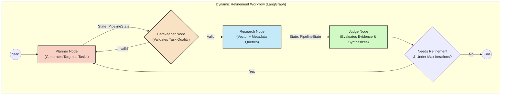

# TracePoint System Architecture & Dataflow

TracePoint evaluates claims using a cyclic investigation workflow built heavily on **LangGraph**. The backend orchestration shifts away from a rigid pipeline towards a dynamic refinement cycle that actively iterates until it satisfies a pre-defined burden of proof.

## Cyclic Investigation Graph

Instead of executing linearly and failing when missing context, the LangGraph workflow continuously loops: `Planner` -> `Gatekeeper` -> `Research` -> `Judge`. If the Judge determines the evidence is insufficient, it formulates refinement questions and loops back to the Planner for a supplemental pass.

## Dataflow

1. **Ingestion (Evidence Clerk)**:
    - Raw files (PDFs, text, logs) evaluate via `Docling`.
    - Content runs through an `Evidence Clerk` (LLM) to extract structured metrics (`evidence_type`, specialized summaries).
    - Results chunk into the `pgvector` PostgreSQL database alongside vector embeddings.

2. **Investigation (Planner)**:
    - Receives a claim.
    - Determines missing gaps/conflict ("Friction Detection").
    - Constructs `vector_query` statements and `metadata_filters` emphasizing both confirming and disconfirming strategies.

3. **Validation (Gatekeeper)**:
    - Intercepts planned tasks. Checks heuristic rules (e.g. required physical constraints over authorization levels).
    - If tasks fail, forces the planner to regenerate.

4. **Retrieval (Research Agent)**:
    - Executes vector similarity searches against PostgreSQL.
    - Applies rigid metadata filters to isolate specific device logs, HR directory, or physical actions over purely digital traces.

5. **Synthesis (Judge Agent Phase 1 & 2)**:
    - Evaluates each vector-returned evidence chunk. 
    - Builds an `overall_verdict`. If evidence is deemed insufficient, populates `refinement_questions` which trigger the loop back to the Planner for deeper probing.

## Component Map

- **Frontend:** Next.js + React. Connects to backend endpoints, listens to Server-Sent Events (SSE) from the cyclic graph for live interface updates.
- **Backend Graph API:** FastAPI endpoints wrapping LangGraph state tracking (`/workflow/run-stream`).
- **Database Layer:** SQLAlchemy ORM connecting to PostgreSQL + pgvector.

